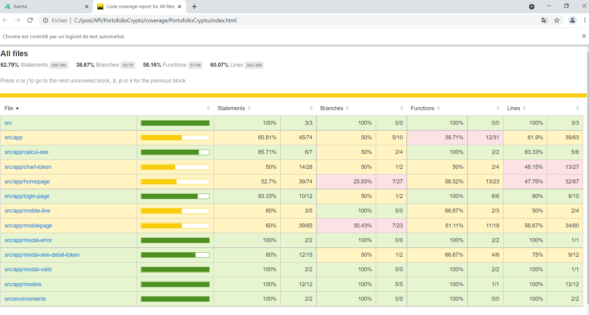

# PortofolioCrypto

This project was generated with [Angular CLI](https://github.com/angular/angular-cli) version 10.2.0.

## Development server

Run `ng serve` for a dev server. Navigate to `http://localhost:4200/`. The app will automatically reload if you change any of the source files.

## Code scaffolding

Run `ng generate component component-name` to generate a new component. You can also use `ng generate directive|pipe|service|class|guard|interface|enum|module`.

## Build

Run `ng build` to build the project. The build artifacts will be stored in the `dist/` directory. Use the `--prod` flag for a production build.

## Running end-to-end tests

Run `ng e2e` to execute the end-to-end tests via [Protractor](http://www.protractortest.org/).

## Further help

To get more help on the Angular CLI use `ng help` or go check out the [Angular CLI Overview and Command Reference](https://angular.io/cli) page.

## Karma Angular for testing

Pour tester le code de l'application nous avons utilisé Karma Angular qui est un outil de terminal JavaScript qui permet le lancement du navigateur web. Une fois le navigateur lancé, Karma y charge le code de l'application et exécute nos tests.

## Running unit tests with Karma

Run `ng test` to execute the unit tests via [Karma](https://karma-runner.github.io).

## Coverage angular

Nous avons aussi utilisé "Coverage Angular" qui va nous permettre de savoir avec une estimation le total du code qui est testé dans sa globalité pour le moment avec un affichage des pourcentages testé, celui-ci est affiché après un "ng test".

## HTML Page for the coverage

Il a une page HTML qui a été mise en place pour voir l'avancée des tests ainsi que leurs pourcentages avec des jauges, la page en question se nomme "index.html" et se trouve dans le dossier "Coverage" du projet. 
L'ouvrir après le lancement du "ng test".

